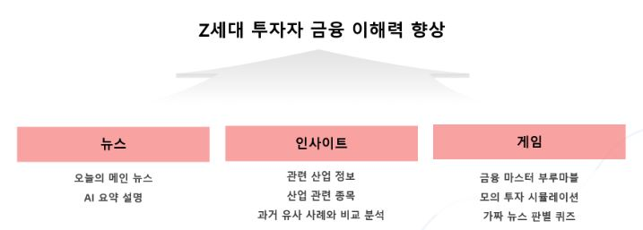
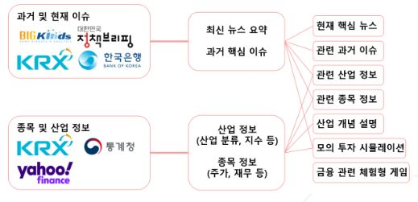
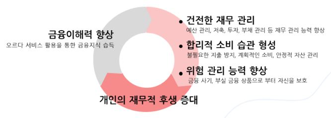
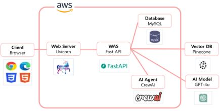

# Fa05-fin-Quantum_Jump
KPMG Future Academy 5기 퀀텀점프팀 마지막 프로젝트 오르다입니다.

## 프로젝트 소개

‘오르다’는 Z세대 투자자의 금융이해력 향상을 목표로 ‘뉴스-인사이트-게임’ 제공을 통해 정보 습득부터 실전 적용까지 단계별 금융 교육 경험을 제공합니다.

---------------------------------------

# 프로젝트 계획서

## 1. 프로젝트 개요
- **프로젝트명** : 오르다 (Orda)
- **목표** : AI를 활용한 Z세대 투자자의 금융 이해력 향상을 지원하는 서비스
- **기간** : 2025년 6월 10일 - 2025년 8월 9일

## 2. 프로젝트 일정
- **분석 및 설계** : 2025년 6월 10일 - 6월 27일
- **개발** : 2025년 7월 1일 - 8월 8일
- **발표** : 2025년 8월 9일

## 3. 팀 구성

---------------------------------------

# 서비스 개요


---------------------------------------

# 전체 서비스 아키텍쳐


---------------------------------------

# 서비스 핵심 기능

## 1. 

---------------------------------------

# 기대효과


---------------------------------------

# 설치 및 실행 방법

## 1. Clone Repository
```
git clone https://github.com/KpmgFuture-Academy/Fa05-fin-Quantum_Jump.git
```

## 2. Install Dependencies
```
pip install -r requirements.txt
```

## 3. 환경 설정
- openai, pinecone api key

## 4. Pinecone 설정
```
python polulate_pinecone
```

## 5. Run Service
```
python main.py
```

---------------------------------------

# 시연 영상
[](https://youtu.be/9TrR2gEKO7M)

---------------------------------------

# 서비스 아키텍쳐


---------------------------------------

# 회고

## 잘한 부분


## 아쉬운 부분


## 느낀점과 개인 성과


## 추후 개선점

---------------------------------------